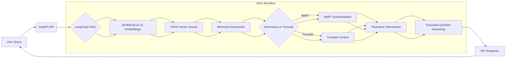
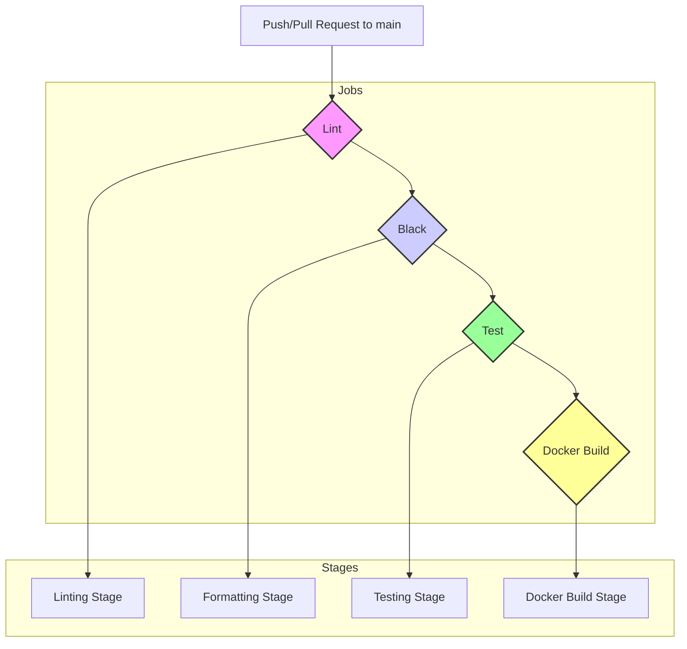

# Zero-Shot RAG-LLM: Amazon Review 2023 Dataset
This project is created and written by Elizabeth Marcellina.

## Project Overview
- The application is Dockerised and deployed via FastAPI, ensuring scalability and modularity. It is production-ready for smaller to medium-scale deployments. It can also be further optimised for high-traffic, enterprise-level environments with more robust deployment options such as NGINX as a reverse proxy or using large-scale production-grade ASGI servers like Gunicorn.
- This application is a CPU-optimised Retrieval Augmented Generation (RAG) system using a subset of the Amazon Review 2023 dataset, i.e. the Gift Cards dataset. The system leverages cutting-edge Nature Language Processing (NLP) techniques for efficient knowledge retrieval and document summarisation, achieving robust performance with minimal task-specific training data.

## Key Technologies
- **HuggingFace transformers**: Pre-trained transformer models used in both retrieval and generation tasks.
- **FAISS**: Efficient similarity search for fast, scalable document retrieval even for large-scale applications.
- **LangChain**: Orchestrates RAG-style workflows, enabling dynamic interaction between retrieval and generation components.
- **all-MiniLM-L6-v2**: Converts the text into vectors (embeddings).
- **BART**: Summarises contextual data from documents retrieved via FAISS. Alternatively, context sentences can be truncated using the API provided in the app.
- **TinyLlama**: Handles tokenisation for both truncating context sentences and inputting the prompt to the model for question answering.
- **FastAPI**: Deployed as a production-ready web application, providing an API interface to the RAG system.
- **Docker**: Containerises the entire application, ensuring consistency and scalability across environments.
- **CI/CD**: Fully automated deployment pipeline incorporating unit tests, linting, and Docker integration, streamlining both development and production workflows.

## Project Features
### Zero-Shot Retrieval Augmented Generation (RAG)
The system retrieves relevant documents and generates insightful summaries without requiring task-specific training, optimising for versatility and generalisation across domains.

### Production-Grade Deployment
The application is Dockerised and deployed via FastAPI, ensuring scalability, modularity, and ease of deployment in both cloud and on-premises environments. It is CPU-optimized and production-ready for smaller to medium-scale deployments, particularly in environments where CPU resources are the primary processing units. For larger, high-throughput environments, or those leveraging GPU acceleration, further optimisation and scaling strategies would be necessary.

## Code Quality & Maintenance
- **Pylint score**: 10/10 (ensures clean, maintainable code)
- **CI/CD pipeline**: Fully automated with unit tests, linting, and Docker integration.
- **Build time**: ~11 minutes (on Github Actions).

## Applications
This project is highly relevant for industries requiring efficient AI-driven knowledge retrieval and document summarisation, including:

- **Enterprise solutions**: Automating document analysis and retrieval processes.
- **Customer support**: Providing automated answers to customer queries based on extensive document datasets.
- **Content generation**: Summarising or generating new content derived from vast knowledge bases added by the user.

## Future Enhancements
- **Model performance metrics**: Planned improvements to include standard evaluation metrics like BLEU and F1 scores for better benchmarking.
- **Optimisation**: Ongoing efforts to fine-tune the model and perform performance benchmarking to improve both retrieval accuracy and content generation quality.
- **Frontend UI**: Development of a React.js-based frontend to provide a user-friendly interface, enabling easy interaction with the system and visualisation of retrieved documents and generated summaries. This will complete the full-stack experience, from backend API to frontend deployment.

## Access & Execution

### Dockerisation
The project is fully containerised. To run the application, simply clone the repository.

#### Running the FastAPI app:
```bash
uvicorn app:app --reload
```
#### Building the Docker image:
```bash
docker build -t rag-llm .
```
#### Running the Docker image:
```bash
docker run -p 8000:8000 rag-llm
```

## API Documentation
To access the API documentation, first run this app, either via FastAPI or Docker.

One can then access the interactive API documentation provided by FastAPI at [http://localhost:8000/docs](http://localhost:8000/docs). This provides a live interface for testing all available endpoints.

## Architectural Diagram
### `app.py`


### CI/CD pipeline (`.github/workflows/main.yml`)


## Known Issues and Limitations
1. **Performance**: The system can experience slower response times, particularly with larger datasets or complex queries. This is due to the reliance on CPU optimisation and retrieval processes. For example, this project (the Dockerised version) was tested on a laptop with an Intel i7 1265U CPU + 16 GB RAM + Windows 11 and another with an Intel Core 7 150U CPU + 16 GB RAM + Windows 11. The latter laptop shows twice faster response times (especially for question answering) than the former.  
2. **Summarisation artefacts**: BART's summarisation may introduce minor artefacts that do not always align conceptually. These artefacts are generally minimal but may require further refinement for more complex data.
3. **Response formatting**: Some responses may contain unwanted characters (e.g., extra slashes or newline characters) due to tokenisation and generation processes. However, these artefacts do not affect the functionality of the app. 

## License
This project is licensed under the terms of the [Apache License, Version 2.0](http://www.apache.org/licenses/LICENSE-2.0) and [MIT License](https://opensource.org/licenses/MIT).

### Apache 2.0 Licensed Components:
- TinyLlama
- BART
- all-MiniLM-L6-v2

### MIT Licensed Components:
- FAISS
- Amazon Review 2023 dataset

This software is distributed on an "AS IS" BASIS, without warranties or conditions of any kind. See the License for the specific language governing permissions and limitations.
