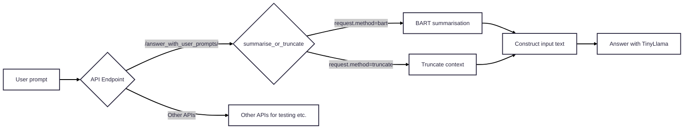
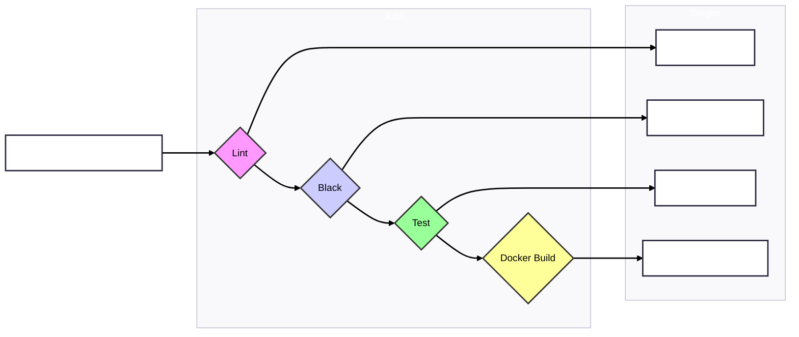

# Zero-Shot Retrieval Augmented Generation (RAG)-LLM: Amazon Review 2023 Dataset
This project is created and written by Elizabeth Marcellina. This question answering chatbot software is scalable, CPU-efficient RAG-LLM application, deployable from laptops to enterprise environments. The Amazon Review 2023 dataset is a public domain dataset (with MIT License), and, for this project, I (Elizabeth) used a subset of the dataset, namely, the "Gift Cards" portion of the dataset.

## Author Contact
The author (Elizabeth Marcellina) can be contacted on LinkedIn: https://www.linkedin.com/in/elizabeth-marcellina/.

## Frontend UI 
I have developed a TypeScript/React-based frontend to provide a user-friendly interface, enabling easy interaction with the system and visualisation of retrieved documents and generated summaries. The repo for the frontend UI can be found in: https://github.com/EMarc2023/zero-shot-rag-llm-frontend.

## Build Status
[](https://github.com/EMarc2023/zero-shot-rag-llm/actions/workflows/main.yml)

## Project Overview
- The application is Dockerised and deployed via FastAPI, ensuring scalability and modularity. It is production-ready for smaller to medium-scale deployments. It can also be further optimised for high-traffic, enterprise-level environments with more robust deployment options such as NGINX as a reverse proxy or using large-scale production-grade ASGI servers like Gunicorn.
- This application is a CPU-optimised Retrieval Augmented Generation (RAG) system using a subset of the Amazon Review 2023 dataset, i.e. the Gift Cards dataset. The system leverages cutting-edge Natural Language Processing (NLP) techniques for efficient knowledge retrieval and document summarisation, achieving robust performance with minimal task-specific training data.

## Key Technologies
- **Hugging Face transformers**: Pre-trained transformer models used in both retrieval and generation tasks.
- **FAISS**: Efficient similarity search for fast, scalable document retrieval even for large-scale applications.
- **LangChain**: Used to create the retrieval chain that interacts with FAISS to retrieve the most relevant texts.
- **all-MiniLM-L6-v2**: Converts the text into vectors (embeddings).
- **BART**: Summarises contextual data from documents retrieved via FAISS. Alternatively, context sentences can be truncated using the API provided in the app.
- **TinyLlama**: Handles tokenisation for both truncating context sentences and inputting the prompt to the model for question answering.
- **FastAPI**: Deployed as a production-ready web application, providing an API interface to the RAG system.
- **Docker**: Containerises the entire application, ensuring consistency and scalability across environments.
- **CI/CD**: Fully automated deployment pipeline incorporating unit tests, linting, and Docker integration, streamlining both development and production workflows.

## Project Features
### Zero-Shot Retrieval Augmented Generation (RAG)
The system retrieves relevant documents and generates insightful summaries without requiring task-specific training, optimising for versatility and generalisation across domains.

### Production-Grade Deployment
The application is Dockerised and deployed via FastAPI, ensuring scalability, modularity, and ease of deployment in both cloud and on-premises environments. It is CPU-optimised and production-ready for smaller to medium-scale deployments, particularly in environments where CPU resources are the primary processing units. For larger, high-throughput environments, or those leveraging GPU acceleration, further optimisation and scaling strategies would be necessary.

## Code Quality & Maintenance
- **Pylint score**: 10/10 (ensures clean, maintainable code)
- **CI/CD pipeline**: Fully automated with unit tests, linting, and Docker integration.
- **Build time**: Up to ~11 minutes on Github Actions.

## Applications
This project is highly relevant for industries requiring efficient AI-driven knowledge retrieval and document summarisation, including:
- **Enterprise solutions**: Automating document analysis and retrieval processes. 
- **Customer support**: Providing automated answers to customer queries based on extensive document datasets.
- **Content generation**: Summarising or generating new content derived from vast knowledge bases added by the user.

## Access & Execution
To run the application, simply clone the repository and follow the following steps:

### Running the FastAPI app (without Docker):
Go to the local repo directory, and then run the following commmand:

```bash
uvicorn app:app --reload
```

### Dockerisation
Install Docker in your local computer, and then run the following commands:

#### Building the Docker image:
```bash
docker build -t rag-llm .
```

#### Running the app via the Docker image:
```bash
docker run -p 8000:8000 rag-llm
```

## API Documentation
To access the API documentation, first run this app, either via FastAPI or Docker.

One can then access the interactive API documentation provided by FastAPI at [http://localhost:8000/docs](http://localhost:8000/docs). This provides a live interface for testing all available endpoints.

## Architectural Diagrams
### `app.py`

### CI/CD pipeline (`.github/workflows/main.yml`)


## Cloud Deployment Considerations
Given this application has been Dockerised, this application is ready to be run on cloud VMs (e.g., AWS EC2, GCP Compute Engine, Azure VMs) or scalable container orchestration systems (like AWS ECS, Kubernetes). The usual process involves pushing the Docker image to a container registry and then running it on the cloud infrastructure. 

The frontend, a TypeScript/React UI currently hosted privately on AWS Amplify, is built for efficient delivery via static hosting services and CDNs. To establish communication between the deployed frontend and backend, the frontend's REACT_APP_BACKEND_API_URL setting must be updated with the backend's public URL. For portfolio cost management, the backend API is not constantly cloud-hosted but can be easily run locally.

## Known Issues and Limitations
1. **Performance**: The system can experience slower response times, particularly with larger datasets or complex queries. This is due to the reliance on CPU optimisation and retrieval processes. For example, this project (the Dockerised version) was tested on a laptop with an Intel i7 1265U CPU + 16 GB RAM + Windows 11 and another with an Intel Core 7 150U CPU + 16 GB RAM + Windows 11. The latter laptop shows twice faster response times (especially for question answering) than the former, with the latter showing total response times ranging from around 20 to 30 seconds - from prompting, RAG, context summarisation/truncation, and answer generation.  
2. **Summarisation artefacts**: BART's summarisation may introduce minor artefacts that do not always align conceptually. These artefacts are generally minimal but may require further refinement for more complex data.
3. **Response formatting**: Some responses may contain unwanted characters (e.g., extra slashes or newline characters) due to tokenisation and generation processes. However, these artefacts do not affect the functionality of the app. 

## Future Work and Strategic Roadmap

### Towards Multi-Agent and Multi-Modal AI Systems
These future developments aim to evolve the RAG-LLM into a more autonomous, contextually aware, and versatile AI system capable of tackling highly complex, multi-faceted business challenges by leveraging specialised AI agents and integrating multimodal inputs for a truly holistic understanding. Infrastructure considerations (e.g., transition to GPU-accelerated cloud environments) would be paramount to support these advanced capabilities.

To further enhance this chatbot capabilities, scalability, and ability to tackle increasingly complex real-world challenges, two key advancements may be explored:

1. Evolution Towards a Multi-Agent AI System
Concept: Transitioning from a single, sequential pipeline to a collaborative network of specialised AI agents. Each agent would handle distinct tasks (e.g., dedicated Orchestrator, Retrieval, Reasoning, Summarisation Agents) and communicate asynchronously.
Architectural Shifts: This involves decomposing current modular components into independent microservices (e.g., using FastAPI and Docker) and implementing a robust inter-agent communication layer (e.g.,  using message queues like Kafka).
Benefits: This architecture enables handling multi-faceted queries, improves scalability through independent agent deployment, enhances debugging through modularity, and allows for greater specialisation and robustness in complex problem-solving.

2. Integration of Multimodal AI Capabilities
Concept: Extending the system's understanding beyond text to process and generate insights from diverse data modalities.
Modalities: Incorporating the ability to interpret and integrate information from images, audio, and video alongside text. This would involve leveraging Multimodal Large Language Models (MLLMs).
Benefits: Unlocks richer contextual understanding for real-world scenarios (e.g., analysing images in a document, understanding voice queries with accompanying visual data). This allows the system to tackle more comprehensive business problems that involve varied data types.

### LLM metrics, fine-tuning, and persistence considerations

- **Model performance metrics**: Planned improvements to include standard evaluation metrics like BLEU and F1 scores for better benchmarking.
- **Optimisation**: The LLM used may need fine tuning so that the content generation quality can be improved.
- **LLM and transformers persistence**: While the Docker image builds and runs the chatbot successfully, on each container startup, the required question-answering LLM and other transformers are downloaded. This adds to the startup times and dependence on the internet to run this software. For future work, persistent storage for the question-answering LLM and transformers should be mounted using Docker volumes (or a similar mechanism) to improve startup time and resource efficiency for larger-scale production deployments. Furthermore, storing the LLM and transformers in a mounted volume will allow one to swap the question-answering LLMs more easily, thereby facilitating integration of more advanced LLMs into the question answering pipeline. **NB:** If one runs this software without Docker, the question anwering LLM and the other transformers will be downloaded to the local computer once and do not need to be re-downloaded.

## License
This project is licensed under the terms of the [Apache License, Version 2.0](http://www.apache.org/licenses/LICENSE-2.0) and [MIT License](https://opensource.org/licenses/MIT).

### Apache 2.0 Licensed Components:
- TinyLlama
- BART
- all-MiniLM-L6-v2

### MIT Licensed Components:
- FAISS
- Amazon Review 2023 dataset

This software is distributed on an "AS IS" BASIS, without warranties or conditions of any kind. See the License for the specific language governing permissions and limitations.
